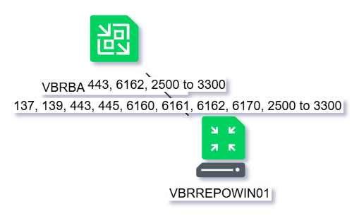
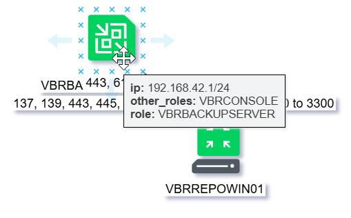
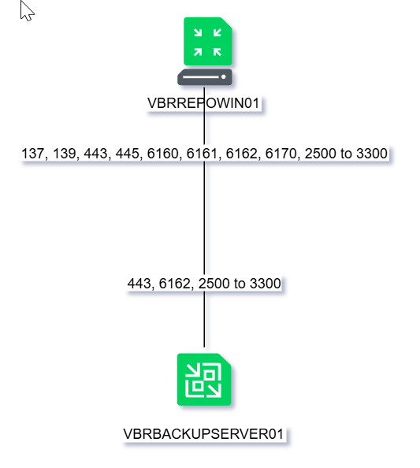
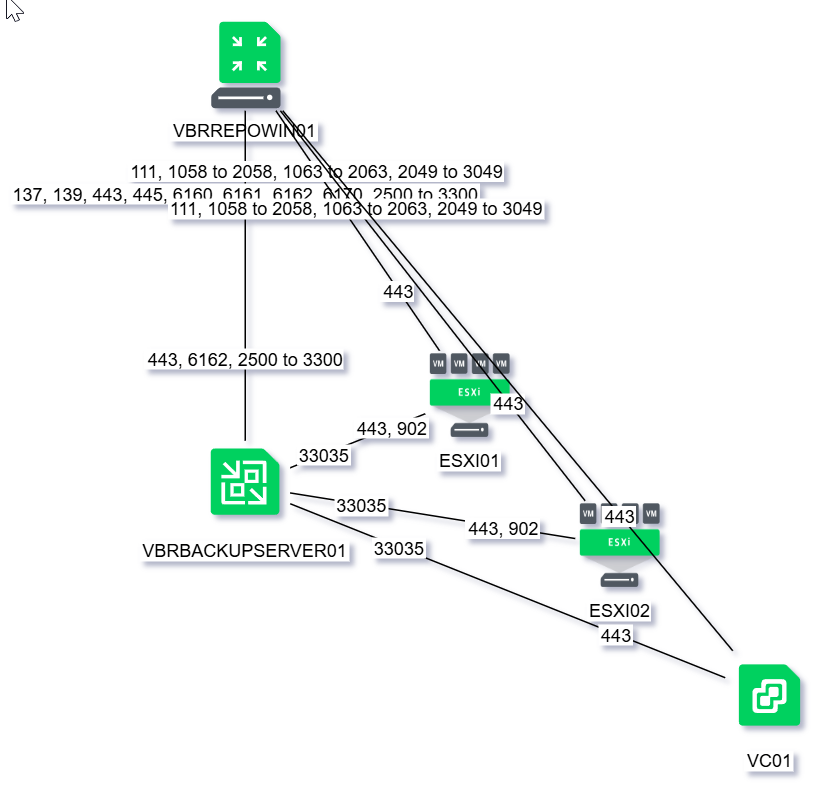
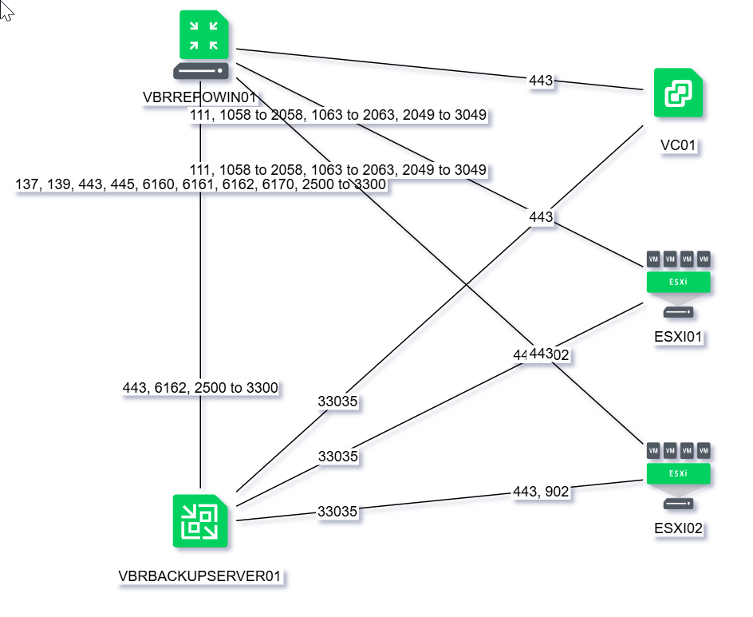

## Introduction

This project was inspired by the [MagicPorts website](https://magicports.veeambp.com/), which provides a representation of the TCP/IP ports used by Veeam products.

From this, I set out to build a tool that can generate:

1. **Draw.io schematics** of a Veeam infrastructure, including TCP/IP port information.
2. **Firewall rule representations** of a Veeam infrastructure, including TCP/IP port information.

## How it works

**VeeamDesigner** generates its output from:

- A database containing the relationships between the Veeam system roles.
- A series of shapes in Draw.io format.
- A project file.
- The existing Draw.io schematic, if one is already present.

The database has been generated by scraping the information from the Veeam website.

The shapes have been, for the most part, sourced from the [Veeam Brand Resource Center Architecture Icons](https://www.veeam.com/company/brand-resource-center.html), with some adaptations.

The project file is a text file containing the list of systems in the schematic for a specific Veeam infrastructure.

The existing Draw.io schematic, if present, is read to recover some information — in particular, the position of each system in the drawing — so that manual position adjustments are preserved when the schematic is regenerated.

## Sample project

In the folder `sample/example1` I've set up a sample project for a small backup infrastructure, to demonstrate what this project is about.

There are 4 versions of the same project, showing several steps.

To look at the `.md` files, all you'll need is your favorite text editor, and for the `.drawio` file you can use the [Draw.io Web App](https://app.diagrams.net/).

### v1 — Bare minimum

A first run with just two systems defined: the backup server and the repository. VeeamDesigner has no prior drawing to read from, so both systems are auto-positioned, and the ports between them are drawn automatically from the role relationships in the database.



Hovering over a system shows a tooltip with its IP address, primary role, and any additional (secondary) roles it plays:



### v2 — Manual repositioning

The two systems are simply moved into a cleaner, vertical layout in Draw.io. Running VeeamDesigner again picks up the existing drawing and preserves this manual positioning.



### v3 — Adding systems

The vCenter server and two ESXi hosts are added to the project file. On regeneration, the previously positioned systems keep their place, while the new ones are auto-positioned — resulting in the raw, unarranged layout below.



### v4 — Final layout

Starting from v3, the systems are manually rearranged into a clear, readable layout.



## Environment setup

Get the repository from GitHub and save it in a new folder. If you are unfamiliar with GitHub (like me, trust me), go to the repository's **Tags** tab, where you'll find a zip file for the release you want — download it.

Expand the content into a **VeeamDesigner** directory; that will be the root of the project.

Open a new command prompt and go to the **VeeamDesigner** root directory.

Then install Python. This project was developed with Python 3.14, and this document assumes Python is available in your PATH so it can be run directly from the command line — the tool itself is command-line only.

Create a Python virtual environment (optional but recommended), from the root of the project:
```
python -m venv venv
call venv\scripts\activate.bat
```

Install the required modules:
```
pip install beautifulsoup4 flask n2g
```

Copy and customize, if needed, these setup customize files first use:
```
copy env.sample env.cmd
copy utility\init_db\role_mappings_sample.py utility\init_db\role_mappings.py
```

Edit `env.cmd` and set `PROJECTDIR` to the path where you extracted **VeeamDesigner** — the sample below uses `c:\projects\veeamdesigner` as an example.

Then deactivate the virtual environment:
```
call venv\scripts\deactivate.bat
```

### Sample env.cmd
```batch
set PROJECTDIR=c:\projects\veeamdesigner
call %PROJECTDIR%\venv\scripts\activate.bat
set PATH=%PATH%;C:\Program Files\Python314\scripts;
set PYTHONPATH=%PROJECTDIR%\modules
set STYLES=%PROJECTDIR%\styles
```

Before running any command in a new shell, run the environment setup script from the root directory of **VeeamDesigner**:
```
call env.cmd
```
`env.cmd` activates the virtual environment and sets the required environment variables.

XXXXXXXXXX

## Create a new project

Each project lives in its own subdirectory.

Open a new command prompt, and go to the veeamdesigner root directory.

Create the project folder (named **myproject** in this example) and copy the reference database into it:

```
mkdir samples\myproject
copy utility\init_db\veeamdesigner.db samples\myproject\myproject.db
```

Create the project file `samples\myproject\myproject.vd`. This is a plain text file that lists all the systems involved in the project and their roles. See the **Project file format** section for the full specification.

#### Step 4 — Generate a drawing script

Run `veeamdesigner.py` from inside the project folder, passing the project name and a drawing name:

```
cd %PROJECTDIR%\samples\myproject
python %PROJECTDIR%\veeamdesigner.py -p myproject -w site_a
```

This produces a Python script `site_a.py` in the current folder. The script, when executed, generates the Draw.io diagram `site_a.drawio`.

What happens internally:

1. The systems matching the drawing name `site_a` are loaded from `myproject.vd` into the `systems` table.
2. If `site_a.drawio` already exists, node positions are read from it.
3. For each system, an `add_node` call is written to the script, using the existing position if available, or an auto-calculated position if not.
4. For each role relationship found in `ports_definitions`, an `add_link` call is written with the relevant ports as labels.

---

#### Step 5 — Run the drawing script

```
python site_a.py
```

This executes the generated script and writes `site_a.drawio` in the same folder. Open it in Draw.io (desktop or web).

On the first run, nodes are placed automatically: the first node starts at `x=300, y=300`, and each subsequent node is offset by 100 in both axes. The layout will be a diagonal staircase — this is intentional. You will rearrange it manually.

---

#### Step 6 — Arrange the diagram in Draw.io

Open `site_a.drawio` in Draw.io and move the nodes to where you want them. Save the file.

The next time you run Step 4, `veeamdesigner.py` will read the updated positions from `site_a.drawio` and use them in the regenerated script. Your layout is preserved across iterations.


